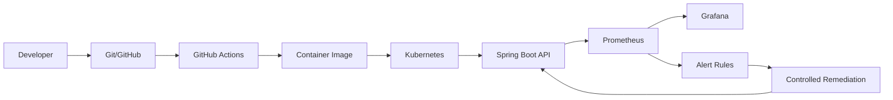

# Architecture

The application is intentionally a single bounded service so the reliability behavior is easy to understand and operate locally. Kubernetes provides restart/self-healing primitives; application endpoints provide safe failure injection and remediation demonstration.
